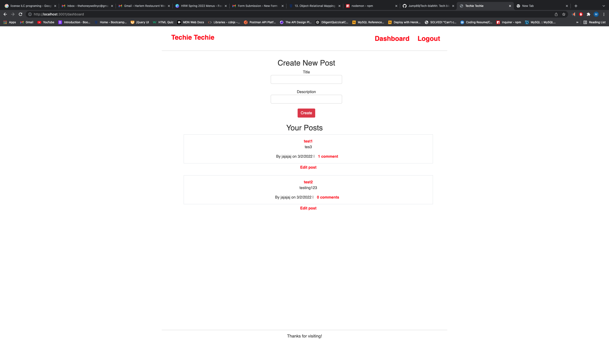

# Tech-blahhh
Tech blog

## Description 

* This is an Tech Blog application that allows you to create posts, comment on posts, edit and delete post.

## User Story 

* AS A developer who writes about tech
I WANT a CMS-style blog site
SO THAT I can publish articles, blog posts, and my thoughts and opinions

## Features

* Fully functioning navigation bar
* Sign up form
* Create unique username and password 
* Create Posts
* Edit Posts
* Comment on Posts
* Delete Posts

## Installation

* npm i 
* npm start
* follow link to heroku 
* sign up 
* enjoy

## Dependencies

* [dotenv](https://www.npmjs.com/package/dotenv)
* [Mysql2](https://www.npmjs.com/package/mysql2)
* [Jest](https://jestjs.io/docs/expect)

## License

* No Licenses for this Application 

## Credits 

* [Marcio Ramos]{https://github.com/Jump89}

## Resources 

* No Resources for this Application

## Front End

* [Javascript]
* [Css]
* [Bootstrap5]

## Backend

* [Express-handlebars](https://www.npmjs.com/package/express-handlebars)
* [MySql](https://www.npmjs.com/package/mysql2)
* [Sequelize](https://sequelize.org/)
 
## Repo

* (https://github.com/Jump89/Tech-blahhh)

## Heroku Link

* (https://damp-dawn-24804.herokuapp.com/)

## Screen Shoot of Application

* 